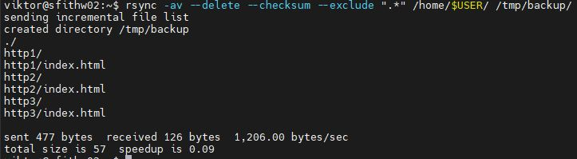
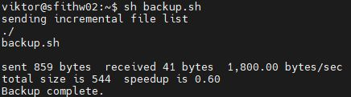

# Домашнее задание к занятию 3 "`Резервное копирование`" - `Лебедев Виктор`


### Инструкция по выполнению домашнего задания

   1. Сделайте `fork` данного репозитория к себе в Github и переименуйте его по названию или номеру занятия, например, https://github.com/имя-вашего-репозитория/git-hw или  https://github.com/имя-вашего-репозитория/7-1-ansible-hw).
   2. Выполните клонирование данного репозитория к себе на ПК с помощью команды `git clone`.
   3. Выполните домашнее задание и заполните у себя локально этот файл README.md:
      - впишите вверху название занятия и вашу фамилию и имя
      - в каждом задании добавьте решение в требуемом виде (текст/код/скриншоты/ссылка)
      - для корректного добавления скриншотов воспользуйтесь [инструкцией "Как вставить скриншот в шаблон с решением](https://github.com/netology-code/sys-pattern-homework/blob/main/screen-instruction.md)
      - при оформлении используйте возможности языка разметки md (коротко об этом можно посмотреть в [инструкции  по MarkDown](https://github.com/netology-code/sys-pattern-homework/blob/main/md-instruction.md))
   4. После завершения работы над домашним заданием сделайте коммит (`git commit -m "comment"`) и отправьте его на Github (`git push origin`);
   5. Для проверки домашнего задания преподавателем в личном кабинете прикрепите и отправьте ссылку на решение в виде md-файла в вашем Github.
   6. Любые вопросы по выполнению заданий спрашивайте в чате учебной группы и/или в разделе “Вопросы по заданию” в личном кабинете.

---

### Задание 1

1. `Составьте команду rsync, которая позволяет создавать зеркальную копию домашней директории пользователя в директорию /tmp/backup`
2. `Необходимо исключить из синхронизации все директории, начинающиеся с точки (скрытые)`
3. `Необходимо сделать так, чтобы rsync подсчитывал хэш-суммы для всех файлов, даже если их время модификации и размер идентичны в источнике и приемнике.`
4. `На проверку направить скриншот с командой и результатом ее выполнения`

### Решение 1

**1. Запускаем команду**
```
rsync -av --delete --checksum --exclude ".*" /home/$USER/ /tmp/backup/
```
**2. Скриншот с командой и результатом выполнения **


---

### Задание 2

1. `Написать скрипт и настроить задачу на регулярное резервное копирование домашней директории пользователя с помощью rsync и cron.`
2. `Резервная копия должна быть полностью зеркальной`
3. `Резервная копия должна создаваться раз в день, в системном логе должна появляться запись об успешном или неуспешном выполнении операции`
4. `Резервная копия размещается локально, в директории /tmp/backup`
5. `На проверку направить файл crontab и скриншот с результатом работы утилиты.`

### Решение 2
**1. Создаем скрипт**
```
nano backup.sh
chmod +x backup.sh
```
**2. Пункт 2**
```
#!/bin/bash
FROM="/home/$USER/"
TO="/tmp/backup/"
ISKL=".*"  # Исключаем скрытые файлы и директории
LOG_FILE="/var/log/backup.log"
DATE=$(date +%Y-%m-%d_%H-%M-%S)
mkdir -p "$TO"
rsync -av --delete --checksum --exclude "$ISKL" "$FROM" "$TO"
if [ $? -eq 0 ]; then
  logger -t backup_script "Backup complete to $TO in $DATE"
  echo "Backup complete."
else
  logger -t backup_script "Error backup to $TO in $DATE"
  echo "Backup error."
  exit 1 
fi

exit 0 
```
**3. Добавляем скрипт в crontab**
```
crontab -e
0 0 * * * /home/viktor/backup.sh
```
**3. Скриншот работы скрипта **

**4. Файл crontab **
<a href="crontab">crontab</a>
